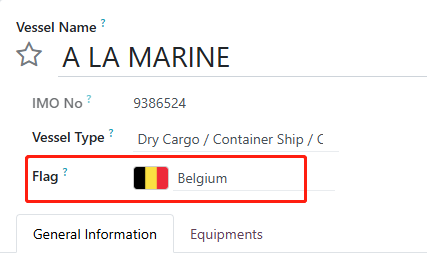
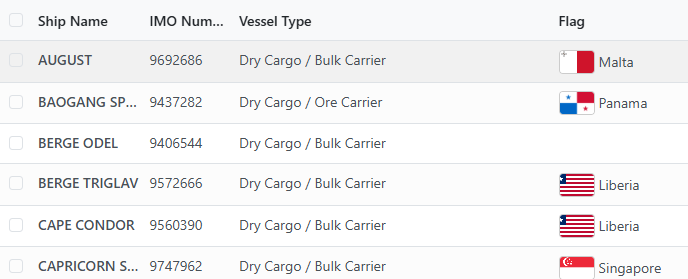
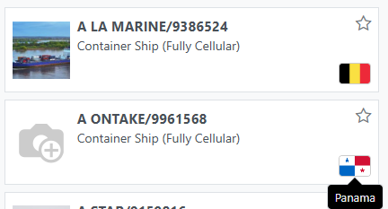

# Many2one Country Flag


[](https://github.com/Alexmalab)
[](https://github.com/Alexmalab/OdooFrontendExtensions/tree/18.0/many2one_country_flag)

## Description

- A country flag field widget `many2one_country_flag` supports for form, list and kanban views, only support for `Many2one` country field.
- Using original image url showing on the country record to render the flag.

Usage example:
```xml
<field name="flag_country_id" widget="many2one_country_flag" options="{'hide_country_name':True}"/>
```
- option `hide_country_name` is default to `False`.

**Effect Preview:**

- form view 

    
- list view 

    
- kanban view 

    

## Bug Tracker
Bugs are tracked on [GitHub Issues](https://github.com/Alexmalab/OdooFrontendExtensions/issues). In case of trouble, please check there if your issue has already been reported. If you spotted it first, help us to smash it by providing a detailed and welcomed feedback.

## Credits
### Authors

- [Alexandre Ma](https://github.com/Alexmalab)

### Contributors

- Alexandre Ma<[alex.ma@hatchtec.com](mailto:a1exma@hotmail.com)>

### Copyright

The copyright of this module belongs to [Alexandre Ma](https://github.com/Alexmalab)

## License
   - 
